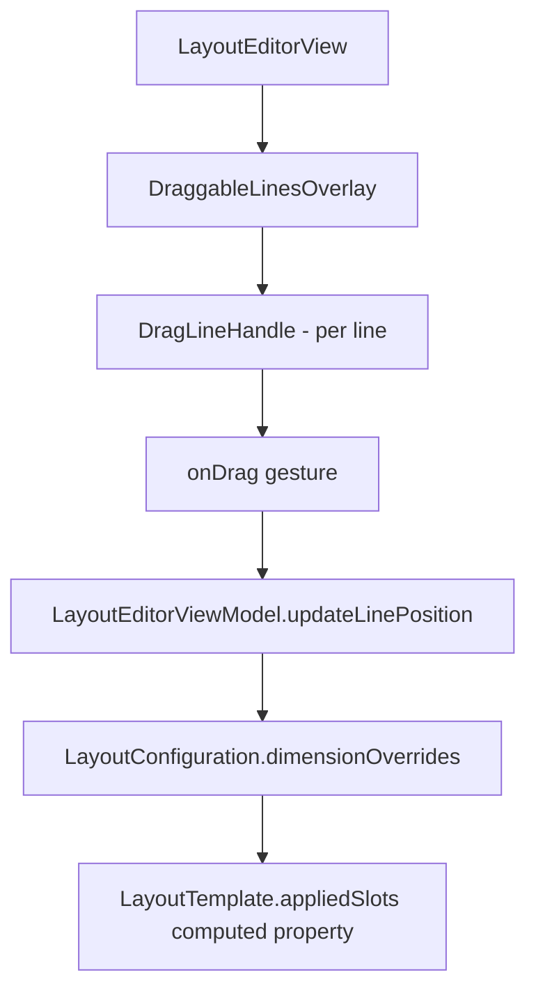

# Design: Draggable Interior Lines

## Context
The Layout Editor currently uses `LayoutTemplate` with fixed slot definitions (normalized 0-1 coordinates). Users want to adjust slot proportions without changing templates. This feature adds drag interactions on interior divider lines.

## Goals
- Allow users to resize layout slots by dragging interior divider lines
- Preserve slot shape topology (no triangles becoming rectangles)
- Persist dimension overrides across editing sessions
- Provide clear visual feedback during drag operations

## Non-Goals
- Changing slot count or layout structure (use template picker for that)
- Freeform slot repositioning (only axis-aligned resizing)
- Dragging outer canvas borders

## Decisions

### 1. Dimension Override Model
**Decision**: Store dimension multipliers per template, not modified slot coordinates.

**Rationale**: 
- Simpler: A 2x1 grid stores one value (vertical divider position: 0.0-1.0)
- Templates define topology; overrides adjust proportions
- Easier to validate constraints (min/max bounds)

**Structure**:
```swift
struct DimensionOverrides: Codable {
    // Key: "h0.5" for horizontal at y=0.5, "v0.5" for vertical at x=0.5
    // Value: new position (0.0-1.0)
    var linePositions: [String: CGFloat] = [:]
}
```

### 2. Draggable Line Detection
**Decision**: Interior lines that do NOT point to any slot corner are draggable.

**Criteria for a line to be draggable**:
1. The line is an interior divider (shared between two slots)
2. Neither endpoint of the line is a slot corner (i.e., the line doesn't point to a corner)

**Rationale**: Lines pointing to corners define the shape of non-rectangular slots (e.g., triangles). Moving such lines would alter the slot shape, which violates the user constraint.

### 3. Minimum Edge Constraint
**Decision**: Minimum slot edge = 10% of canvas dimension (0.1 normalized).

**Rationale**: Smaller slots become impractical for photo display and gesture interaction.

### 4. Visual Feedback
**Decision**: Show a small drag handle icon (↕ for horizontal, ↔ for vertical) centered on each draggable line.

**Alternatives considered**:
- Highlight line on hover: Not applicable to touch (no hover state)
- Dotted lines: Less discoverable
- Resize cursor: iOS convention is handle icons

## Risks / Trade-offs
| Risk | Mitigation |
|------|------------|
| Complex polygon topologies | Scope to rectangles only; polygons are read-only |
| Gesture conflicts with photo pan | Priority: slot selection > line drag > photo pan |
| Performance with many slots | Lazy line detection; cache draggable lines |

## Architecture



## Open Questions
- None currently; design is scoped to rectangular slot resizing.
