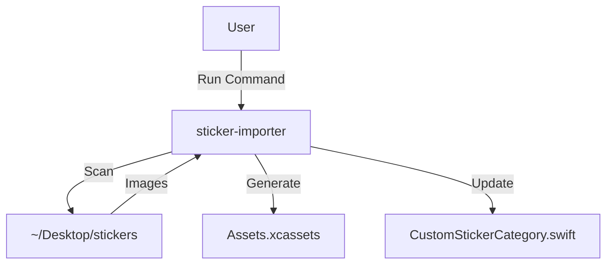

# Design: External Sticker Automation Tool

## Architecture

### Components

1.  **Scanner**:
    *   Input: Root directory path.
    *   Logic: Walks directory tree. Ignores hidden files. Identifies "Category" folders based on depth or structure.
    *   Heuristic: Folder name format `NNNNNNN-category-name` -> Category `category-name`.
    *   Format Priority: Checks for `svg` folder first. If found, imports SVGs. If not, checks for `png` folder.

2.  **AssetManager**:
    *   Input: Image file path, Category name, Sticker name.
    *   Output: Writes files to `InstaBorderApp/Assets.xcassets/Stickers/<Category>/<Sticker>.imageset`.
    *   Structure:
        *   `Contents.json`: Standard Apple JSON.
        *   `Contents.json`: Standard Apple JSON. Configures "Preserve Vector Data" if SVG.
        *   `image.png` or `image.svg`:
            *   If SVG: Configured as "Single Scale" with "Preserve Vector Data".
            *   If PNG: Configured as 1x, 2x, or 3x.

3.  **LabelGenerator** (AI):
    *   Input: Image path.
    *   Logic: Calls Google Gemini API (`gemini-2.0-flash-exp` or similar) to describe the image with 3-5 keywords.
    *   Output: List of strings (e.g. `["cute", "dog", "puppy"]`).

3.  **CodeModifier**:
    *   Input: `CustomStickerCategory.swift` path, List of (Category, [StickerNames]).
    *   Logic:
        *   Reads file content.
        *   Finds `static let allCategories` array.
        *   Parses existing logic (regex or simple parsing).
        *   Inserts new `CustomStickerCategory` structs or appends to existing ones?
        *   *Decision*: The current Swift model has `stickers: [String]`. We need to generate `CustomStickerCategory(name: "Category", localizedKey: "...", stickers: ["sticker1", ...])`.

### Data Flow

